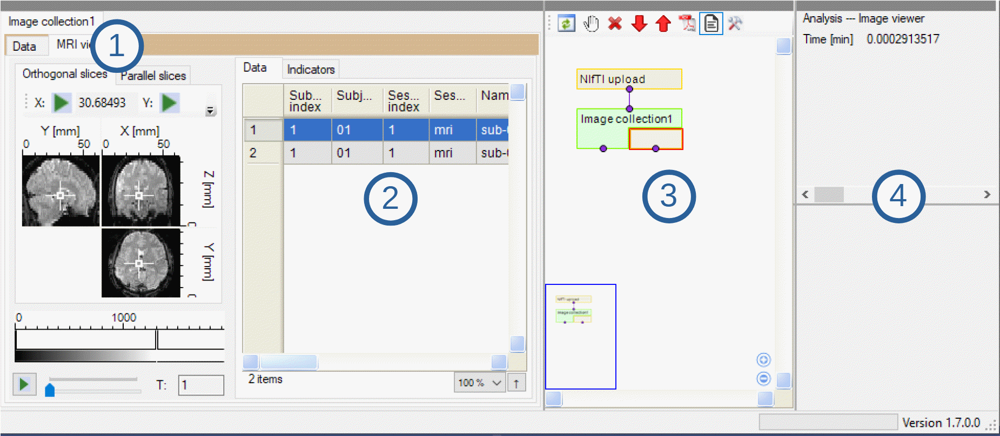

**********
Interface
**********

In this section will be presented a general description of the program: on how to make it run properly to the main interface and how to navigate it.

Installation
=============

Main GUI
=========

After opening Perseus Image plug-in this is the interface that will appear:

*insert image top part*

Top part of the interface. In this section all commands and functions are shown. They are divided depending on the input they require:

1. Load: commands to load new data (:ref:`Load Data <load>`)
2. Processing: commands that require an *image series* (check :ref:`Data Type <data-type>` section to know more about *image collection*)
3. To matrix:
4. Merge with matrix: commands that require a matrix and an *image collection*
5. Analysis: commands that allows to visualize an *image collection* (:ref:`Visualize Images <visualize>`)
6. Export: export the *image collection* selected (:ref:`Save Data <save>`)

Bottom part of the interface. Here is possible to visualize images, keep track of all the processing steps done and check the parameters used.

1. In this part images will appear when is selected to visualize them. The cursor can be freely moved through the three dimensions by clicking on it. Below the images there is a slider that allows to select the colors, by right clicking on the arrow it will be removed. By left clicking on the arrow is instead possible to move it or to change the color. Below the color legend there is a slider that allows to move the image through the fourth dimension (time).

2. This is still part of the image visualization. Here is possible to see how many images and of which type are stored in an *image collection*. Images are divided first into functional (:ref:`Functional Images <functional>`) and anatomical (:ref:`Anatomical Images <anatomical>`). Then moving through the same line in the data frame is possible to check of which subject, session or run the image belongs to. In this section other information on the image are stored, like its dimensions and the complete name.

3. Here, after running any processing step, a block with the name of the step chosen will appear. This interface allows to track all steps taken and to go back to previous image series. The all network can be exported and each node can be stopped or erased to free some memory (although after erasing a node is not possible to undo it). If the appearance of the network is not as wanted, nodes can be freely moved wherever preferred.

4. In this part, after clicking on a node that refers to a command used, it is possible to check which parameters were used. In this way not only functions used, but also their parameters can be easiliy tracked and shared.
